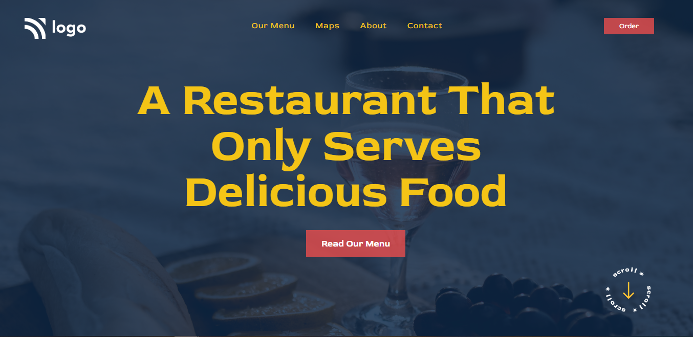

# Restaurant Home Page 

## Project Live Link: [Restaurant Home Page]()

> by Ashwin Kumar Sharma

Screenshot

## Learnings from this project

- Got good understanding of positions and how to use them.
- Learned to upload the background image using CSS only.
- Learned about isolation property to creating a new stacking context.
- Learned about the opacity property using which the tranparency of the background has been set.
- Learned about the property z-index that control the stacking order of elements on a web page along the z-axis.

## Time Taken to finish the project

It took me approximately 3 hours to complete this project.